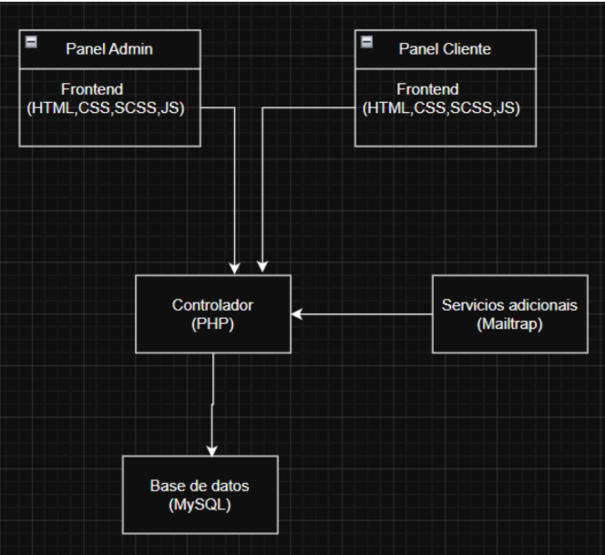
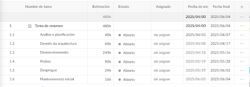
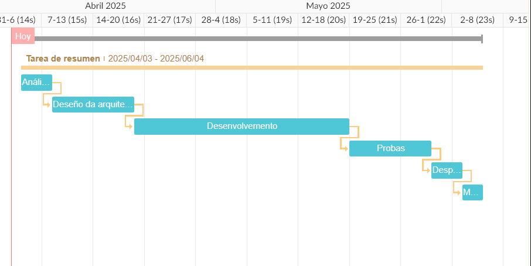
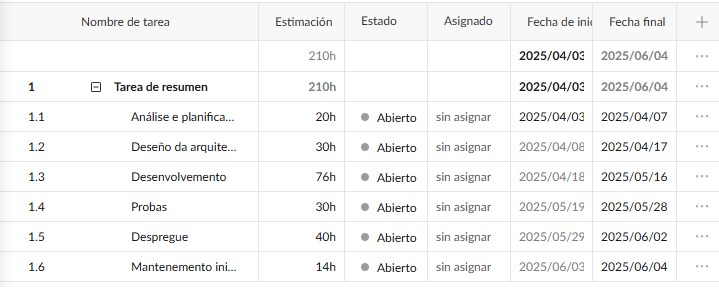
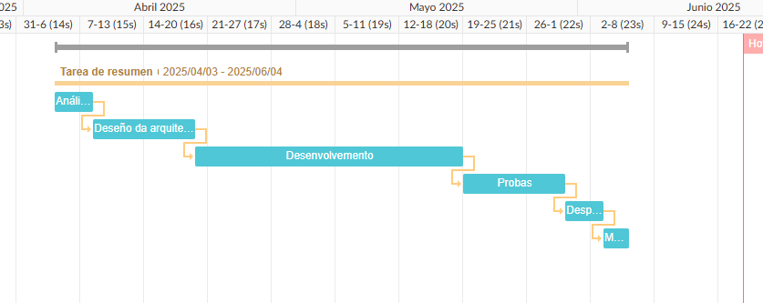
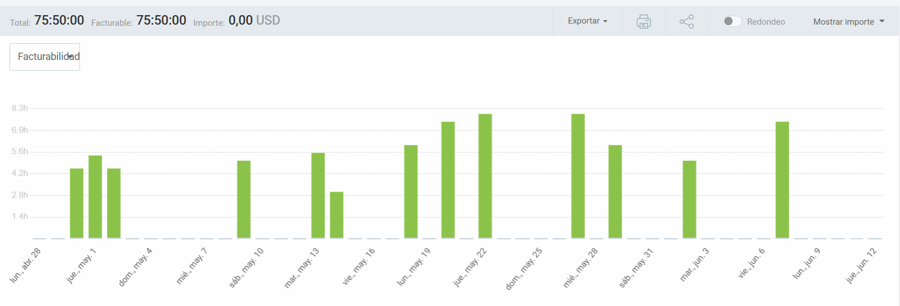
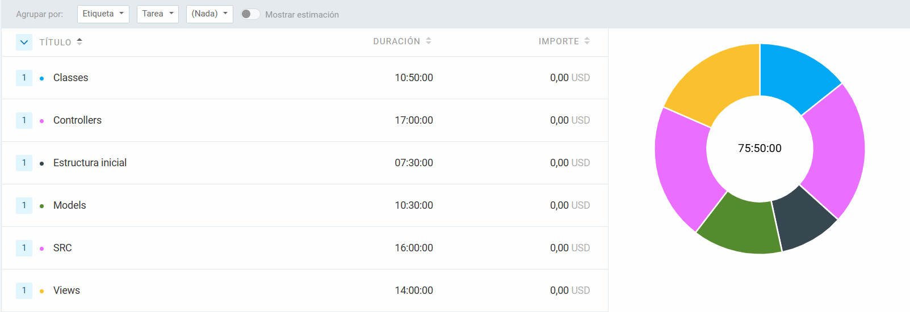

# CutAppoint - Sistema de Gestión de Citas
## 1. Motivación

El sector de las peluquerías, especialmente las pequeñas y medianas, afronta importantes retos en la gestión de citas y en la atención al cliente debido al uso de métodos tradicionales poco eficientes. Esto nace para facilitar la digitalización de estos negocios, ofreciendo una solución sencilla y accesible que mejora la organización de las citas, reduce errores y optimiza el tiempo.

## 2. Demostración del funcionamiento de la aplicación, en base a los objetivos definidos en el anteproyecto.

## 3. Justificación de los objetivos alcanzados y no alcanzados
Durante el desarrollo se cumplieron los objetivos definidos en las historias de usuario. El panel de administración permite a los propietarios gestionar los servicios ofrecidos, tanto creando, editando o eliminando, asi como ver las citas buscando por fecha o eliminando. En el portal del cliente, los usuarios pueden consultar los servicios, precios, reservar citas de forma sencilla y recibir confirmación. Además, se implementó un sistema de envío de email para la confirmación de cuenta y cambio de contraseña. Todas las funcionalidades previstas fueron implementadas.

## 4. Descripción técnica
### Descripción General

Implementa una arquitectura MVC que proporciona una clara separación de responsabilidades y un código mantenible.
Esta separación facilita el mantenimiento del código, su escalabilidad y la reutilización de componentes, ya que cada parte tiene una función bien definida y los cambios en una no afectan directamente a las demás. Por lo tanto, proporciona una base sólida y mantenible para el desarrollo.

### Estructura del Proyecto
```
📁 CutAppoint/
├── 📁 controllers/     # Controladores que manejan la lógica de negocio
├── 📁 models/         # Modelos que interactúan con la base de datos
├── 📁 views/          # Vistas que renderizan la interfaz de usuario
├── 📁 public/         # Archivos públicos accesibles (CSS, JS, imágenes)
└── 📁 includes/       # Utilidades y configuraciones del sistema
```

### Flujo de la Aplicación

1. **Entrada**: El usuario accede a una URL específica
2. **Enrutamiento**: El Router analiza la URL y dirige la petición
3. **Procesamiento**: El Controlador maneja la petición utilizando los Modelos
4. **Datos**: Los Modelos interactúan con la base de datos MySQL
5. **Presentación**: El Controlador envía datos a la Vista correspondiente
6. **Respuesta**: La Vista genera el HTML final para el usuario

### Tecnologías Principales

- **Backend**: 
  - PHP con arquitectura MVC
  - MySQL como sistema de base de datos
  - Composer para gestión de dependencias

- **Frontend**:
  - HTML5 para estructura
  - SCSS para estilos
  - JavaScript para interactividad
  - Gulp como herramienta de construcción

Esta arquitectura está diseñada para facilitar:
- Desarrollo modular
- Mantenibilidad del código
- Escalabilidad del proyecto
- Testing efectivo
- Separación clara de responsabilidades

## 6. Metodología de desarrollo utilizada

La metodología de desarrollo utilizada se basa en un flujo de trabajo estándar con Git y GitHub. El flujo de trabajo es el siguiente:

- **Repositorio central en GitHub:** Todo el código fuente se gestiona en un repositorio principal en GitHub.
- **Ramas principales:** Se utiliza una rama principal para el código.
- **Commits frecuentes y descriptivos:** Cada cambio se registra mediante commits.
- **Pull Requests:** Las nuevas funcionalidades o correcciones se integran a la rama principal mediante Pull Requests.
- **Integración continua:** El código se prueba y revisa antes de ser desplegado.

### Diagrama de componentes


## 7. Diagramas de Gantt
### Diagrama de Gantt previo



### Diagrama de Gantt final



### Análisis y justificación de las diferencias en las estimaciones

Las horas dedicadas fueron menores que las estimadas inicialmente. Esto se debió a una buena planificación, reutilización de componentes y a que algunas tareas resultaron menos complejas de lo previsto. 
Además, el uso de herramientas adecuadas y la experiencia adquirida durante el desarrollo permitieron optimizar tiempos, especialmente en fases de desarrollo.

## 8. Clockify




### Análisis y justificación del tiempo invertido

- **Análisis (20h):** Definición de requisitos y objetivos.
- **Diseño (30h):** Creación de la arquitectura.
- **Desarrollo (76h):** Implementación de la lógica, base de datos y vistas.
- **Pruebas (30h):** Verificación de funcionalidades y corrección de errores.
- **Despliegue (40h):** Configuración del servidor, Docker y AWS; fase más díficil por falta de experiencia previa.
- **Mantenimiento (14h):** Ajustes menores y soporte tras el lanzamiento.

El uso de Clockify ayudó a controlar y optimizar el tiempo dedicado a cada tarea.

## 9. Presupuesto de la aplicación

A continuación se detalla el presupuesto estimado para el desarrollo de la aplicación, incluyendo el coste del software amortizado utilizado en cada fase del ciclo de vida:

| Fase           | Horas estimadas | Coste/hora | Coste personal | Software utilizado           | Coste software amortizado | Coste total fase |
|----------------|-----------------|------------|----------------|-----------------------------|---------------------------|------------------|
| Análisis       | 20              | 20 €       | 400 €          | VS Code, Clockify           | 0 €                       | 400 €            |
| Diseño         | 30              | 20 €       | 600 €          | Figma (10 €), Photoshop     | 10 €                      | 610 €            |
| Desarrollo     | 76              | 20 €       | 1.520 €        | VS Code, Node, GitHub       | 10 €                      | 1.530 €          |
| Pruebas        | 30              | 20 €       | 600 €          | GitHub                      | 0 €                       | 600 €            |
| Despliegue     | 40              | 20 €       | 800 €          | VS Code, Hosting (15 €)     | 5 €                       | 805 €            |
| Mantenimiento  | 14             | 20 €       | 280 €          | VS Code                     | 0 €                       | 280 €            |
| **TOTAL**      | **210**         |            | **4.200 €**    |                             | **25 €**                  | **4.225 €**      |

> **Nota:** El coste del software amortizado se calcula en función del tiempo de uso de las licencias durante el proyecto. La mayoría de las herramientas empleadas son gratuitas o de código abierto, salvo indicación expresa.

## 10. Conclusiones
  CutaAppoint cumplió los objetivos propuestos, ofreciendo una solución eficiente para la gestión de citas. El desarrollo me permitió aplicar y consolidar conocimientos. A pesar de las dificultades encontradas conseguí crear una plataforma funcional para las necesidades reales del sector.
  ### Posibles mejoras
  
  En futuras versiones, se pueden añadir la integración con pasarelas de pago, recordatorios automáticos por SMS, un sistema de valoraciones y reseñas y una pestaña de gestión en la que el usuario pueda ver sus citas.

  ### Principales dificultades encontradas

Durante el desarrollo, me encontré con varios desafíos, especialmente a la hora de estructurar el proyecto y al implementar el patrón ActiveRecord para interactuar con la base de datos. También dediqué tiempo a hacer el diseño de la aplicación, sobre todo en el CSS, para que la interfaz fuera clara, atractiva y funcional.
La mayor dificultad llegó durante el despliegue, donde tuve problemas tanto con la configuración del servidor como con la creación del archivo Dockerfile. Como era mi primera vez trabajando con AWS, todo el proceso de gestionar la aplicación también me supuso un reto.